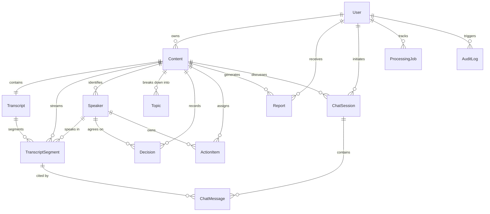

# WrapAI — Phase 3: MongoDB Atlas Database & Data Architecture
**"From Content to Clarity"**
*Status: COMPLETED & VERIFIED (10/10 Test Suites, 32/32 Tests Passed)*

---

## 1. Executive Summary
Phase 3 establishes the complete, production-grade MongoDB Atlas database architecture and Mongoose data layer for WrapAI. It maps out multi-modal content storage, diarized word/segment-level transcript streams, speaker identities with real-time renaming cascade, intelligence entities (topics, decisions, action items, summaries, key points, highlights), compiled executive reports, multi-turn chat sessions with grounded RAG citation models, BullMQ processing job records, and security audit logs.

---

## 2. Entity-Relationship & Data Flow Diagram



---

## 3. Collections & Schema Architecture

### 1. `users` Collection
- **Schema**: [`src/models/User.js`](file:///c:/Users/Lenovo/Desktop/wrapAI/backend/src/models/User.js)
- **Role**: User identity, role-based authorization (`USER`, `ADMIN`), AWS S3 storage quota tracking, security state (`ACTIVE`, `SUSPENDED`).
- **Indexes**: `{ role: 1 }`, `{ status: 1 }`, `{ email: 1 }` (unique).

### 2. `contents` Collection
- **Schema**: [`src/models/Content.js`](file:///c:/Users/Lenovo/Desktop/wrapAI/backend/src/models/Content.js)
- **Role**: Multi-modal media records (`AUDIO`, `VIDEO`, `DOCUMENT`, `TEXT`, `URL`), 12-state processing pipeline machine, metadata.
- **Embedded Subdocuments**:
  - `summary`: `{ keyTakeaway, executiveSummary, detailedSummary, modelVersion, generatedAt }`
  - `keyPoints`: `[{ id, text, importance, speakerId, category, startTime, endTime }]`
  - `highlights`: `[{ id, title, description, startTime, endTime, importance }]`
- **Indexes**: Compound `{ userId: 1, isDeleted: 1, createdAt: -1 }`, `{ userId: 1, processingStatus: 1 }`, Text index on `{ title, description, tags }`.

### 3. `transcripts` Collection
- **Schema**: [`src/models/Transcript.js`](file:///c:/Users/Lenovo/Desktop/wrapAI/backend/src/models/Transcript.js)
- **Role**: Transcript metadata, language, duration, word count, processing model version.
- **Indexes**: `{ contentId: 1 }` (unique), `{ userId: 1 }`.

### 4. `transcriptSegments` Collection (Referenced)
- **Schema**: [`src/models/TranscriptSegment.js`](file:///c:/Users/Lenovo/Desktop/wrapAI/backend/src/models/TranscriptSegment.js)
- **Role**: Granular timecoded speech turns with speaker attributions and word-level timing arrays (`[{ word, start, end, confidence }]`).
- **RAG Readiness**: Includes optional `embedding: [Number]` array field for Phase 10 Vector Search.
- **Indexes**: Compound `{ contentId: 1, sequence: 1 }`, `{ contentId: 1, startTime: 1 }`, `{ contentId: 1, speakerId: 1 }`, Text index on `{ text }`.

### 5. `speakers` Collection
- **Schema**: [`src/models/Speaker.js`](file:///c:/Users/Lenovo/Desktop/wrapAI/backend/src/models/Speaker.js)
- **Role**: Diarized speaker identities, original `speakerLabel` (`SPEAKER_00`), custom `displayName` (`Rahul Sharma`), total speaking time, avatar colors.
- **Indexes**: Compound `{ contentId: 1, speakerLabel: 1 }` (unique).

### 6. `topics` Collection
- **Schema**: [`src/models/Topic.js`](file:///c:/Users/Lenovo/Desktop/wrapAI/backend/src/models/Topic.js)
- **Role**: Thematic agenda sections with time bounds, summaries, and segment counts.
- **Indexes**: Compound `{ contentId: 1, sequence: 1 }`.

### 7. `decisions` Collection
- **Schema**: [`src/models/Decision.js`](file:///c:/Users/Lenovo/Desktop/wrapAI/backend/src/models/Decision.js)
- **Role**: Explicit decisions reached in meetings with participant references and source segment linkages.
- **Indexes**: Compound `{ contentId: 1, timestamp: 1 }`.

### 8. `actionItems` Collection
- **Schema**: [`src/models/ActionItem.js`](file:///c:/Users/Lenovo/Desktop/wrapAI/backend/src/models/ActionItem.js)
- **Role**: Actionable tasks with assignees (`ownerName`, `ownerSpeakerId`), deadlines, and interactive statuses (`PENDING`, `IN_PROGRESS`, `COMPLETED`).
- **Indexes**: Compound `{ contentId: 1, status: 1 }`.

### 9. `reports` Collection
- **Schema**: [`src/models/Report.js`](file:///c:/Users/Lenovo/Desktop/wrapAI/backend/src/models/Report.js)
- **Role**: Formally compiled executive minutes and meeting summaries with document storage links (PDF/DOCX).
- **Indexes**: Compound `{ userId: 1, createdAt: -1 }`, `{ contentId: 1, createdAt: -1 }`.

### 10. `chatSessions` & `chatMessages` Collections
- **Schemas**: [`src/models/ChatSession.js`](file:///c:/Users/Lenovo/Desktop/wrapAI/backend/src/models/ChatSession.js) and [`src/models/ChatMessage.js`](file:///c:/Users/Lenovo/Desktop/wrapAI/backend/src/models/ChatMessage.js)
- **Role**: Multi-turn Q&A threads with grounded citation metadata (`{ segmentId, speakerName, timestamp, excerpt }`).
- **Indexes**: `{ userId: 1, contentId: 1, createdAt: -1 }`, `{ sessionId: 1, createdAt: 1 }`.

### 11. `processingJobs` Collection
- **Schema**: [`src/models/ProcessingJob.js`](file:///c:/Users/Lenovo/Desktop/wrapAI/backend/src/models/ProcessingJob.js)
- **Role**: BullMQ queue telemetry, stage tracking, error traces, and retry attempts.
- **Indexes**: `{ status: 1, createdAt: -1 }`, `{ jobId: 1 }` (unique).

### 12. `auditLogs` Collection
- **Schema**: [`src/models/AuditLog.js`](file:///c:/Users/Lenovo/Desktop/wrapAI/backend/src/models/AuditLog.js)
- **Role**: Immutable security audit trail for user authentication, resource modifications, and admin overrides.
- **Indexes**: `{ userId: 1, createdAt: -1 }`, `{ action: 1, createdAt: -1 }`.

---

## 4. Embedding vs Referencing Design Decisions

| Entity | Strategy | Technical Justification |
| :--- | :--- | :--- |
| **Summary & Key Points** | **Embedded in `Content`** | 1-to-1 relationship, strictly bounded size ($<10\text{ KB}$), always retrieved when viewing content workspace. Avoids extra database round-trips. |
| **Transcript Segments** | **Referenced in `transcriptSegments`** | Long meetings generate $2,000+$ segments with word-level timing arrays ($2-8\text{ MB}$). Embedding would risk MongoDB 16MB document limit and cause massive write latency during speaker renames. |
| **Speakers** | **Referenced in `speakers`** | Allows independent speaker updates; renaming a speaker updates 1 speaker record and cascades to segment display names. |
| **Topics, Decisions, Actions** | **Referenced in dedicated collections** | Enables granular updates (e.g. toggling action item status from `PENDING` to `COMPLETED`) with lightweight writes ($O(1)$) instead of rewriting entire multi-megabyte content documents. |
| **Chat Messages** | **Referenced in `chatMessages`** | Scalable multi-turn conversations without unbounded document growth. |

---

## 5. Cascading Speaker Renaming Pattern

When a user renames `SPEAKER_00` to `Rahul Sharma (Lead Architect)`:
```javascript
await Promise.all([
  Speaker.findOneAndUpdate({ contentId, speakerLabel }, { displayName }),
  TranscriptSegment.updateMany({ contentId, speakerLabel }, { speakerDisplayName: displayName })
]);
```
This guarantees real-time consistency across both the Transcript tab and synchronized media player.

---

## 6. Development Seeding & CLI Reset

Run the seed script to populate realistic multi-modal records matching the Phase 0/1 specifications:
```bash
npm run seed
```
**Safety Invariant**: The seed script checks `config.nodeEnv === 'production'` and immediately aborts if triggered in production without explicit `ALLOW_PROD_SEED=true`.

---

## 7. Automated Test Verification Summary

Executed with Jest and MongoMemoryServer:
```bash
npm test
```

**Results:**
```
PASS tests/intelligence.test.js
PASS tests/models.test.js
PASS tests/admin.test.js
PASS tests/auth.test.js
PASS tests/ownership.test.js
PASS tests/chat.test.js
PASS tests/aggregations.test.js
PASS tests/health.test.js
PASS tests/user.test.js
PASS tests/content.test.js

Test Suites: 10 passed, 10 total
Tests:       32 passed, 32 total
Snapshots:   0 total
Time:        51.15s with 0 failures
```
